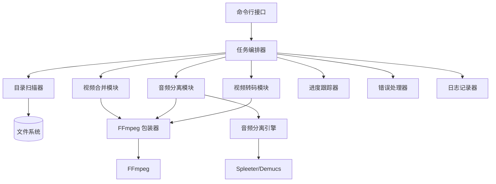

# 设计文档：短剧视频批量处理工具

## 概述

短剧视频批量处理工具是一个基于 FFmpeg 的命令行工具，提供三个独立的视频处理功能模块。系统采用模块化设计，每个功能可以独立运行，通过标准化的目录结构实现处理流水线。

### 核心功能

1. **视频合并模块**：将多个视频片段和字幕文件合并为完整的视频和字幕
2. **音频分离模块**：去除背景音乐，保留人声对话
3. **视频转码模块**：生成多种分辨率和格式的视频文件

### 处理流水线

```
video/ + srt/ → [合并] → merged/ → [音频分离] → cleared/ → [转码] → encoded/
```

## 架构

### 系统架构图



### 模块职责

#### 1. 命令行接口 (CLI)
- 解析命令行参数
- 验证输入参数
- 调用相应的功能模块

#### 2. 任务编排器 (Orchestrator)
- 协调各个模块的执行
- 管理批量处理流程
- 处理任务队列

#### 3. 目录扫描器 (Scanner)
- 扫描 drama/ 根目录
- 验证目录结构
- 识别待处理的短剧目录

#### 4. 视频合并模块 (Merger)
- 合并多个视频片段
- 合并字幕文件并调整时间戳
- 生成输出文件到 merged/ 目录

#### 5. 音频分离模块 (Separator)
- 提取音频轨道
- 分离人声和背景音乐
- 重新合成视频

#### 6. 视频转码模块 (Transcoder)
- 转码为多种分辨率
- 保持宽高比
- 复制字幕文件

#### 7. FFmpeg 包装器
- 封装 FFmpeg 命令
- 处理 FFmpeg 进程
- 解析 FFmpeg 输出

#### 8. 进度跟踪器
- 跟踪任务进度
- 显示进度信息
- 计算完成百分比

#### 9. 错误处理器
- 捕获和记录错误
- 提供错误恢复机制
- 生成错误报告

## 组件和接口

### 核心接口定义

```python
from abc import ABC, abstractmethod
from dataclasses import dataclass
from pathlib import Path
from typing import List, Optional, Callable
from enum import Enum

class ProcessingStatus(Enum):
    """处理状态枚举"""
    PENDING = "pending"
    IN_PROGRESS = "in_progress"
    COMPLETED = "completed"
    FAILED = "failed"
    SKIPPED = "skipped"

@dataclass
class ProcessingResult:
    """处理结果"""
    status: ProcessingStatus
    input_path: Path
    output_path: Optional[Path]
    error_message: Optional[str] = None
    duration_seconds: float = 0.0

@dataclass
class ProgressInfo:
    """进度信息"""
    current: int
    total: int
    current_file: str
    percentage: float

class ProgressCallback(ABC):
    """进度回调接口"""
    @abstractmethod
    def on_progress(self, info: ProgressInfo) -> None:
        pass
    
    @abstractmethod
    def on_file_start(self, filename: str) -> None:
        pass
    
    @abstractmethod
    def on_file_complete(self, result: ProcessingResult) -> None:
        pass

class VideoProcessor(ABC):
    """视频处理器基类"""
    @abstractmethod
    def process(
        self, 
        drama_dir: Path, 
        progress_callback: Optional[ProgressCallback] = None
    ) -> ProcessingResult:
        """处理单个短剧目录"""
        pass
    
    @abstractmethod
    def process_batch(
        self, 
        drama_dirs: List[Path],
        progress_callback: Optional[ProgressCallback] = None
    ) -> List[ProcessingResult]:
        """批量处理多个短剧目录"""
        pass
```

### 视频合并模块接口

```python
@dataclass
class VideoSegment:
    """视频片段"""
    path: Path
    duration_seconds: float
    index: int

@dataclass
class SubtitleSegment:
    """字幕片段"""
    path: Path
    index: int
    format: SubtitleFormat

class VideoMerger(VideoProcessor):
    """视频合并器"""
    
    def scan_video_segments(self, video_dir: Path) -> List[VideoSegment]:
        """扫描并排序视频片段"""
        pass
    
    def scan_subtitle_segments(self, srt_dir: Path) -> List[SubtitleSegment]:
        """扫描并排序字幕片段（支持 SRT 和 ASS 格式）"""
        pass
    
    def merge_videos(
        self, 
        segments: List[VideoSegment], 
        output_path: Path
    ) -> None:
        """合并视频片段"""
        pass
    
    def merge_subtitles(
        self, 
        segments: List[SubtitleSegment],
        video_segments: List[VideoSegment],
        output_path: Path
    ) -> None:
        """合并字幕文件并调整时间戳（自动检测格式）"""
        pass
    
    def detect_subtitle_format(self, srt_dir: Path) -> Optional[SubtitleFormat]:
        """检测字幕格式（返回第一个找到的格式）"""
        pass
```

### 音频分离模块接口

```python
class AudioSeparator(VideoProcessor):
    """音频分离器"""
    
    def extract_audio(self, video_path: Path) -> Path:
        """从视频中提取音频"""
        pass
    
    def separate_vocals(self, audio_path: Path) -> tuple[Path, Path]:
        """分离人声和背景音乐
        
        Returns:
            (vocal_path, background_path)
        """
        pass
    
    def replace_audio(
        self, 
        video_path: Path, 
        audio_path: Path, 
        output_path: Path
    ) -> None:
        """替换视频的音频轨道"""
        pass
```

### 视频转码模块接口

```python
@dataclass
class TranscodeSpec:
    """转码规格"""
    width: int
    height: int
    video_codec: str = "libx264"
    audio_codec: str = "aac"
    
    @property
    def resolution_name(self) -> str:
        """分辨率名称，如 1080p"""
        return f"{self.height}p"

class VideoTranscoder(VideoProcessor):
    """视频转码器"""
    
    PRESET_SPECS = [
        TranscodeSpec(1920, 1080),  # 1080p
        TranscodeSpec(1280, 720),   # 720p
        TranscodeSpec(854, 480),    # 480p
    ]
    
    def get_video_resolution(self, video_path: Path) -> tuple[int, int]:
        """获取视频分辨率"""
        pass
    
    def transcode(
        self, 
        input_path: Path, 
        output_path: Path, 
        spec: TranscodeSpec
    ) -> None:
        """转码视频"""
        pass
    
    def should_skip_spec(
        self, 
        input_resolution: tuple[int, int], 
        target_spec: TranscodeSpec
    ) -> bool:
        """判断是否应该跳过该规格"""
        pass
```

### FFmpeg 包装器接口

```python
@dataclass
class FFmpegCommand:
    """FFmpeg 命令"""
    inputs: List[Path]
    output: Path
    options: List[str]

class FFmpegWrapper:
    """FFmpeg 包装器"""
    
    def execute(
        self, 
        command: FFmpegCommand,
        progress_callback: Optional[Callable[[float], None]] = None
    ) -> None:
        """执行 FFmpeg 命令"""
        pass
    
    def get_video_info(self, video_path: Path) -> dict:
        """获取视频信息"""
        pass
    
    def get_video_duration(self, video_path: Path) -> float:
        """获取视频时长（秒）"""
        pass
```

### 目录扫描器接口

```python
@dataclass
class DramaDirectory:
    """短剧目录"""
    path: Path
    name: str
    has_video_dir: bool
    has_srt_dir: bool
    has_merged_dir: bool
    has_cleared_dir: bool

class DirectoryScanner:
    """目录扫描器"""
    
    def scan_drama_root(self, root_path: Path) -> List[DramaDirectory]:
        """扫描 drama/ 根目录"""
        pass
    
    def validate_for_merge(self, drama_dir: DramaDirectory) -> bool:
        """验证目录是否适合合并操作"""
        pass
    
    def validate_for_separation(self, drama_dir: DramaDirectory) -> bool:
        """验证目录是否适合音频分离操作"""
        pass
    
    def validate_for_transcode(self, drama_dir: DramaDirectory) -> bool:
        """验证目录是否适合转码操作"""
        pass
```

## 数据模型

### 字幕时间戳模型

```python
from abc import ABC, abstractmethod
from enum import Enum

class SubtitleFormat(Enum):
    """字幕格式枚举"""
    SRT = "srt"
    ASS = "ass"

@dataclass
class SubtitleEntry:
    """字幕条目（通用格式）"""
    index: int
    start_time: float  # 秒
    end_time: float    # 秒
    text: str
    style: Optional[str] = None  # ASS 格式的样式信息
    
    def shift_time(self, offset_seconds: float) -> 'SubtitleEntry':
        """偏移时间戳"""
        return SubtitleEntry(
            index=self.index,
            start_time=self.start_time + offset_seconds,
            end_time=self.end_time + offset_seconds,
            text=self.text,
            style=self.style
        )

class SubtitleParser(ABC):
    """字幕解析器基类"""
    @abstractmethod
    def parse(self, file_path: Path) -> List[SubtitleEntry]:
        """解析字幕文件"""
        pass
    
    @abstractmethod
    def format_entry(self, entry: SubtitleEntry) -> str:
        """格式化单个字幕条目"""
        pass
    
    @abstractmethod
    def get_header(self) -> str:
        """获取文件头部（ASS 格式需要）"""
        pass

class SRTParser(SubtitleParser):
    """SRT 格式解析器"""
    
    def parse(self, file_path: Path) -> List[SubtitleEntry]:
        """解析 SRT 文件"""
        entries = []
        with open(file_path, 'r', encoding='utf-8') as f:
            content = f.read()
        
        # 解析 SRT 格式
        # 格式: 序号\n时间戳\n文本\n\n
        blocks = content.strip().split('\n\n')
        for block in blocks:
            lines = block.strip().split('\n')
            if len(lines) >= 3:
                index = int(lines[0])
                time_line = lines[1]
                text = '\n'.join(lines[2:])
                
                # 解析时间戳: 00:00:01,000 --> 00:00:03,000
                start_str, end_str = time_line.split(' --> ')
                start_time = self._parse_srt_time(start_str)
                end_time = self._parse_srt_time(end_str)
                
                entries.append(SubtitleEntry(
                    index=index,
                    start_time=start_time,
                    end_time=end_time,
                    text=text
                ))
        
        return entries
    
    def _parse_srt_time(self, time_str: str) -> float:
        """解析 SRT 时间格式为秒"""
        # 格式: 00:00:01,000
        time_str = time_str.replace(',', '.')
        parts = time_str.split(':')
        hours = int(parts[0])
        minutes = int(parts[1])
        seconds = float(parts[2])
        return hours * 3600 + minutes * 60 + seconds
    
    def _format_srt_time(self, seconds: float) -> str:
        """格式化秒为 SRT 时间格式"""
        hours = int(seconds // 3600)
        minutes = int((seconds % 3600) // 60)
        secs = seconds % 60
        millisecs = int((secs % 1) * 1000)
        secs = int(secs)
        return f"{hours:02d}:{minutes:02d}:{secs:02d},{millisecs:03d}"
    
    def format_entry(self, entry: SubtitleEntry) -> str:
        """格式化为 SRT 格式"""
        start = self._format_srt_time(entry.start_time)
        end = self._format_srt_time(entry.end_time)
        return f"{entry.index}\n{start} --> {end}\n{entry.text}\n"
    
    def get_header(self) -> str:
        """SRT 没有头部"""
        return ""

class ASSParser(SubtitleParser):
    """ASS 格式解析器"""
    
    def __init__(self):
        self.header_lines = []
        self.styles = {}
    
    def parse(self, file_path: Path) -> List[SubtitleEntry]:
        """解析 ASS 文件"""
        entries = []
        with open(file_path, 'r', encoding='utf-8') as f:
            lines = f.readlines()
        
        in_events = False
        index = 1
        
        for line in lines:
            line = line.strip()
            
            # 保存头部信息
            if line.startswith('[Events]'):
                in_events = True
                continue
            
            if not in_events:
                self.header_lines.append(line)
                # 解析样式信息
                if line.startswith('Style:'):
                    parts = line.split(':', 1)[1].split(',')
                    if parts:
                        style_name = parts[0].strip()
                        self.styles[style_name] = line
                continue
            
            # 解析事件行
            if line.startswith('Dialogue:'):
                parts = line.split(':', 1)[1].split(',', 9)
                if len(parts) >= 10:
                    start_time = self._parse_ass_time(parts[1].strip())
                    end_time = self._parse_ass_time(parts[2].strip())
                    style = parts[3].strip()
                    text = parts[9].strip()
                    
                    entries.append(SubtitleEntry(
                        index=index,
                        start_time=start_time,
                        end_time=end_time,
                        text=text,
                        style=style
                    ))
                    index += 1
        
        return entries
    
    def _parse_ass_time(self, time_str: str) -> float:
        """解析 ASS 时间格式为秒"""
        # 格式: 0:00:01.00
        parts = time_str.split(':')
        hours = int(parts[0])
        minutes = int(parts[1])
        seconds = float(parts[2])
        return hours * 3600 + minutes * 60 + seconds
    
    def _format_ass_time(self, seconds: float) -> str:
        """格式化秒为 ASS 时间格式"""
        hours = int(seconds // 3600)
        minutes = int((seconds % 3600) // 60)
        secs = seconds % 60
        return f"{hours}:{minutes:02d}:{secs:05.2f}"
    
    def format_entry(self, entry: SubtitleEntry) -> str:
        """格式化为 ASS 格式"""
        start = self._format_ass_time(entry.start_time)
        end = self._format_ass_time(entry.end_time)
        style = entry.style or "Default"
        # ASS 格式: Dialogue: Layer,Start,End,Style,Name,MarginL,MarginR,MarginV,Effect,Text
        return f"Dialogue: 0,{start},{end},{style},,0,0,0,,{entry.text}\n"
    
    def get_header(self) -> str:
        """获取 ASS 文件头部"""
        return '\n'.join(self.header_lines) + '\n\n[Events]\nFormat: Layer, Start, End, Style, Name, MarginL, MarginR, MarginV, Effect, Text\n'

class SubtitleFile:
    """字幕文件"""
    
    def __init__(
        self, 
        entries: List[SubtitleEntry],
        format: SubtitleFormat,
        parser: SubtitleParser
    ):
        self.entries = entries
        self.format = format
        self.parser = parser
    
    @classmethod
    def parse(cls, file_path: Path) -> 'SubtitleFile':
        """解析字幕文件（自动检测格式）"""
        ext = file_path.suffix.lower()
        
        if ext == '.srt':
            parser = SRTParser()
            format = SubtitleFormat.SRT
        elif ext == '.ass':
            parser = ASSParser()
            format = SubtitleFormat.ASS
        else:
            raise ValueError(f"不支持的字幕格式: {ext}")
        
        entries = parser.parse(file_path)
        return cls(entries, format, parser)
    
    def save(self, file_path: Path) -> None:
        """保存字幕文件"""
        with open(file_path, 'w', encoding='utf-8') as f:
            # 写入头部（如果有）
            header = self.parser.get_header()
            if header:
                f.write(header)
            
            # 写入所有条目
            for entry in self.entries:
                f.write(self.parser.format_entry(entry))
                if self.format == SubtitleFormat.SRT:
                    f.write('\n')  # SRT 格式需要额外的空行
    
    def shift_all(self, offset_seconds: float) -> 'SubtitleFile':
        """偏移所有字幕时间戳"""
        shifted_entries = [
            entry.shift_time(offset_seconds)
            for entry in self.entries
        ]
        return SubtitleFile(shifted_entries, self.format, self.parser)
    
    def get_extension(self) -> str:
        """获取文件扩展名"""
        return f".{self.format.value}"
```

### 处理任务模型

```python
@dataclass
class ProcessingTask:
    """处理任务"""
    task_id: str
    drama_dir: DramaDirectory
    processor_type: str  # "merge", "separate", "transcode"
    status: ProcessingStatus
    created_at: float
    started_at: Optional[float] = None
    completed_at: Optional[float] = None
    error: Optional[str] = None

class TaskQueue:
    """任务队列"""
    tasks: List[ProcessingTask]
    
    def add_task(self, task: ProcessingTask) -> None:
        """添加任务"""
        pass
    
    def get_next_task(self) -> Optional[ProcessingTask]:
        """获取下一个待处理任务"""
        pass
    
    def update_task_status(
        self, 
        task_id: str, 
        status: ProcessingStatus,
        error: Optional[str] = None
    ) -> None:
        """更新任务状态"""
        pass
    
    def get_statistics(self) -> dict:
        """获取统计信息"""
        pass
```

### 配置模型

```python
@dataclass
class ProcessingConfig:
    """处理配置"""
    # 通用配置
    drama_root: Path
    max_workers: int = 4  # 并发处理数量（默认 4 个线程）
    
    # 断点续传配置
    enable_resume: bool = True  # 启用断点续传
    state_file: Path = Path(".drama_processor_state.json")
    
    # 音频分离配置
    audio_separator_model: str = "spleeter:2stems"  # 或 "demucs"
    
    # 转码配置
    transcode_specs: List[TranscodeSpec] = None
    preserve_aspect_ratio: bool = True
    
    # 输出配置
    overwrite_existing: bool = False
    add_numeric_suffix: bool = True
    
    # 报告配置
    generate_report: bool = True
    report_dir: Path = Path("reports")
    
    # 日志配置
    log_level: str = "INFO"
    log_file: Optional[Path] = None
    
    def __post_init__(self):
        if self.transcode_specs is None:
            self.transcode_specs = VideoTranscoder.PRESET_SPECS
```


## 正确性属性

属性是一种特征或行为，应该在系统的所有有效执行中保持为真——本质上是关于系统应该做什么的形式化陈述。属性作为人类可读规范和机器可验证正确性保证之间的桥梁。

### 文件处理属性

**属性 1：文件排序一致性**
*对于任意*包含数字编号的文件列表（如 video-001.mp4, video-002.mp4），系统排序后的文件顺序应该与文件名中的数字顺序一致
**验证需求：1.2, 1.3**

**属性 2：文件类型过滤**
*对于任意*包含多种文件类型的目录，系统应该只返回指定扩展名的文件（.mp4 或 .srt/.ass）
**验证需求：5.5, 5.6**

**属性 3：字幕格式自动检测**
*对于任意*字幕文件（.srt 或 .ass），系统应该正确识别其格式并使用相应的解析器
**验证需求：1.3, 1.5**

**属性 4：字幕格式保持**
*对于任意*输入字幕格式（SRT 或 ASS），合并后的输出字幕应该保持相同的格式
**验证需求：1.7**

**属性 5：目录模式识别**
*对于任意*目录结构，系统应该正确识别所有符合 drama-XXXX 命名模式的子目录，并且不识别不符合模式的目录
**验证需求：5.1**

**属性 6：文件复制一致性**
*对于任意*字幕文件，复制操作后的文件内容应该与原文件内容完全相同（字节级别）
**验证需求：2.8, 3.7**

**属性 7：文件命名冲突处理**
*对于任意*已存在的文件，当创建同名文件时，新文件名应该包含数字后缀，并且不应该覆盖原文件
**验证需求：5.9**

### 视频合并属性

**属性 8：视频合并时长守恒**
*对于任意*视频片段列表，合并后的视频总时长应该等于所有输入片段时长之和（允许 ±0.1 秒的误差）
**验证需求：1.4**

**属性 9：字幕时间戳偏移**
*对于任意*字幕文件和视频片段列表，合并后第 N 个字幕文件的所有时间戳应该偏移前 N-1 个视频片段的累计时长
**验证需求：1.5**

**属性 10：字幕时间戳单调性**
*对于任意*合并后的字幕文件，所有字幕条目的开始时间应该单调递增（start_time[i] < start_time[i+1]）
**验证需求：1.5**

### 音频分离属性

**属性 11：音频提取时长一致性**
*对于任意*视频文件，提取的音频文件时长应该与原视频时长相同（允许 ±0.1 秒的误差）
**验证需求：2.2**

**属性 12：视频属性保持**
*对于任意*输入视频，音频分离后的输出视频应该保持相同的分辨率（宽度和高度）
**验证需求：2.5**

**属性 13：音频替换后视频时长不变**
*对于任意*视频文件，替换音频轨道后的视频时长应该与原视频时长相同（允许 ±0.1 秒的误差）
**验证需求：2.4**

### 视频转码属性

**属性 14：转码编码格式验证**
*对于任意*转码后的视频文件，其视频编码应该是 H.264，音频编码应该是 AAC
**验证需求：3.3**

**属性 15：转码文件命名格式**
*对于任意*输入文件和目标分辨率，输出文件名应该符合格式 {原文件名}_{分辨率}.mp4
**验证需求：3.4**

**属性 16：宽高比保持**
*对于任意*输入视频和目标分辨率，转码后的视频宽高比应该与输入视频宽高比相同（允许 ±0.01 的误差）
**验证需求：3.8**

**属性 17：分辨率跳过逻辑**
*对于任意*输入视频，如果其分辨率低于目标分辨率，系统不应该生成该目标分辨率的输出文件
**验证需求：3.11**

### 批量处理属性

**属性 18：批量处理完整性**
*对于任意*短剧目录列表，批量处理后的结果数量应该等于输入目录数量
**验证需求：1.8, 2.9, 3.9**

**属性 19：错误隔离**
*对于任意*包含有效和无效目录的列表，即使某些目录处理失败，其他有效目录仍应该被成功处理
**验证需求：4.6**

### 进度和统计属性

**属性 20：进度百分比范围**
*对于任意*处理任务，进度百分比应该始终在 0 到 100 之间（包含边界）
**验证需求：4.3**

**属性 21：统计信息一致性**
*对于任意*批量处理任务，成功数量 + 失败数量应该等于总任务数量
**验证需求：4.5**

**属性 22：错误信息完整性**
*对于任意*失败的处理任务，错误信息应该包含文件路径和错误原因
**验证需求：4.4**

### 目录管理属性

**属性 23：输出目录自动创建**
*对于任意*不存在的输出目录路径，系统在保存文件前应该自动创建该目录
**验证需求：5.7**

**属性 24：目录验证正确性**
*对于任意*短剧目录，如果缺少功能所需的输入目录（video/、merged/、cleared/），验证函数应该返回 false
**验证需求：5.2, 5.3, 5.4**

### 并发和性能属性

**属性 25：并发处理结果完整性**
*对于任意*短剧目录列表和并发数量，并发处理后的结果数量应该等于输入目录数量
**验证需求：新增**

**属性 26：并发处理线程安全**
*对于任意*并发处理任务，多个线程同时更新进度信息时不应该产生数据竞争或不一致
**验证需求：新增**

### 断点续传属性

**属性 27：状态持久化一致性**
*对于任意*处理任务，保存到状态文件后重新加载，状态信息应该与保存前完全一致
**验证需求：新增**

**属性 28：已完成任务跳过**
*对于任意*已标记为完成的任务，启用断点续传时该任务不应该被重新处理
**验证需求：新增**

**属性 29：输出文件验证**
*对于任意*标记为完成的任务，如果其输出文件不存在，系统应该将其视为未完成
**验证需求：新增**

### 智能排序属性

**属性 30：自然排序正确性**
*对于任意*包含数字的文件名列表，自然排序后的顺序应该符合人类直觉（如 file-2.mp4 在 file-10.mp4 之前）
**验证需求：1.2, 1.3**

**属性 31：序列连续性检测**
*对于任意*文件序列，如果存在缺失的序号，验证函数应该返回 false 并指出缺失的序号
**验证需求：新增**

**属性 32：序列重复检测**
*对于任意*文件序列，如果存在重复的序号，验证函数应该返回 false 并指出重复的序号
**验证需求：新增**

### 报告和统计属性

**属性 33：报告统计一致性**
*对于任意*处理报告，成功数量 + 失败数量 + 跳过数量应该等于总任务数量
**验证需求：4.5**

**属性 34：失败任务错误信息完整性**
*对于任意*失败的任务，报告中应该包含该任务的路径和详细错误信息
**验证需求：4.4**

**属性 35：报告序列化往返一致性**
*对于任意*处理报告，序列化为 JSON 后再反序列化，关键信息应该保持一致
**验证需求：新增**

## 错误处理

### 错误分类

#### 1. 输入验证错误
- 目录不存在
- 目录结构不符合要求
- 必需的输入文件缺失
- 文件格式不支持

**处理策略**：
- 记录详细错误信息
- 跳过当前任务
- 继续处理下一个任务

#### 2. FFmpeg 执行错误
- FFmpeg 命令执行失败
- 视频编码错误
- 音频处理错误

**处理策略**：
- 捕获 FFmpeg 标准错误输出
- 记录完整的错误信息和命令
- 清理临时文件
- 标记任务为失败状态

#### 3. 音频分离错误
- 音频分离库加载失败
- 音频分离处理失败
- 内存不足

**处理策略**：
- 记录详细错误堆栈
- 提供降级方案（跳过音频分离）
- 继续处理其他任务

#### 4. 文件系统错误
- 磁盘空间不足
- 权限不足
- 文件被占用

**处理策略**：
- 检查磁盘空间
- 验证文件权限
- 提供清晰的错误提示
- 建议用户采取的行动

### 错误恢复机制

```python
class ErrorRecoveryStrategy(ABC):
    """错误恢复策略"""
    @abstractmethod
    def can_recover(self, error: Exception) -> bool:
        """判断错误是否可恢复"""
        pass
    
    @abstractmethod
    def recover(self, error: Exception, context: dict) -> bool:
        """尝试恢复"""
        pass

class RetryStrategy(ErrorRecoveryStrategy):
    """重试策略"""
    def __init__(self, max_retries: int = 3, delay_seconds: float = 1.0):
        self.max_retries = max_retries
        self.delay_seconds = delay_seconds
    
    def can_recover(self, error: Exception) -> bool:
        # 网络错误、临时文件锁等可以重试
        return isinstance(error, (IOError, OSError))
    
    def recover(self, error: Exception, context: dict) -> bool:
        # 实现重试逻辑
        pass

class SkipStrategy(ErrorRecoveryStrategy):
    """跳过策略"""
    def can_recover(self, error: Exception) -> bool:
        # 输入验证错误应该跳过
        return isinstance(error, ValidationError)
    
    def recover(self, error: Exception, context: dict) -> bool:
        # 记录错误并跳过
        return True
```

### 日志记录

```python
import logging
from pathlib import Path
from typing import Optional

class ProcessingLogger:
    """处理日志记录器"""
    
    def __init__(
        self, 
        log_file: Optional[Path] = None,
        log_level: str = "INFO"
    ):
        self.logger = logging.getLogger("drama_processor")
        self.logger.setLevel(getattr(logging, log_level))
        
        # 控制台处理器
        console_handler = logging.StreamHandler()
        console_handler.setFormatter(
            logging.Formatter('%(asctime)s - %(levelname)s - %(message)s')
        )
        self.logger.addHandler(console_handler)
        
        # 文件处理器
        if log_file:
            file_handler = logging.FileHandler(log_file)
            file_handler.setFormatter(
                logging.Formatter(
                    '%(asctime)s - %(name)s - %(levelname)s - %(message)s'
                )
            )
            self.logger.addHandler(file_handler)
    
    def log_task_start(self, task_type: str, drama_dir: Path) -> None:
        """记录任务开始"""
        self.logger.info(f"开始 {task_type} 任务: {drama_dir}")
    
    def log_task_complete(
        self, 
        task_type: str, 
        drama_dir: Path, 
        duration: float
    ) -> None:
        """记录任务完成"""
        self.logger.info(
            f"完成 {task_type} 任务: {drama_dir} (耗时: {duration:.2f}秒)"
        )
    
    def log_task_error(
        self, 
        task_type: str, 
        drama_dir: Path, 
        error: Exception
    ) -> None:
        """记录任务错误"""
        self.logger.error(
            f"任务失败 {task_type}: {drama_dir} - {str(error)}",
            exc_info=True
        )
    
    def log_validation_error(self, drama_dir: Path, reason: str) -> None:
        """记录验证错误"""
        self.logger.warning(f"验证失败: {drama_dir} - {reason}")
    
    def log_batch_summary(
        self, 
        total: int, 
        success: int, 
        failed: int
    ) -> None:
        """记录批量处理摘要"""
        self.logger.info(
            f"批量处理完成 - 总计: {total}, 成功: {success}, 失败: {failed}"
        )
```

## 测试策略

### 双重测试方法

系统测试采用单元测试和基于属性的测试相结合的方法：

- **单元测试**：验证特定示例、边缘情况和错误条件
- **基于属性的测试**：验证所有输入的通用属性

两者是互补的，对于全面覆盖都是必需的。

### 单元测试重点

单元测试应该专注于：
- 演示正确行为的特定示例
- 组件之间的集成点
- 边缘情况和错误条件

避免编写过多的单元测试——基于属性的测试处理大量输入的覆盖。

### 基于属性的测试配置

- 使用 Python 的 `hypothesis` 库进行基于属性的测试
- 每个属性测试最少运行 100 次迭代（由于随机化）
- 每个测试必须引用其设计文档属性
- 标签格式：**Feature: drama-video-processor, Property {number}: {property_text}**
- 每个正确性属性必须由单个基于属性的测试实现

### 测试用例示例

#### 单元测试示例

```python
import pytest
from pathlib import Path
from drama_processor.merger import VideoMerger

def test_merge_two_videos():
    """测试合并两个视频片段"""
    merger = VideoMerger()
    drama_dir = Path("test_data/drama-0001")
    
    result = merger.process(drama_dir)
    
    assert result.status == ProcessingStatus.COMPLETED
    assert (drama_dir / "merged" / "merged.mp4").exists()
    assert (drama_dir / "merged" / "merged.srt").exists()

def test_merge_without_subtitles():
    """测试在没有字幕的情况下合并视频"""
    merger = VideoMerger()
    drama_dir = Path("test_data/drama-no-srt")
    
    result = merger.process(drama_dir)
    
    assert result.status == ProcessingStatus.COMPLETED
    assert (drama_dir / "merged" / "merged.mp4").exists()
    assert not (drama_dir / "merged" / "merged.srt").exists()

def test_merge_missing_video_directory():
    """测试视频目录缺失的情况"""
    merger = VideoMerger()
    drama_dir = Path("test_data/drama-no-video")
    
    result = merger.process(drama_dir)
    
    assert result.status == ProcessingStatus.FAILED
    assert "video/" in result.error_message
```

#### 基于属性的测试示例

```python
from hypothesis import given, strategies as st
from hypothesis import assume
import pytest

# Feature: drama-video-processor, Property 1: 文件排序一致性
@given(st.lists(st.integers(min_value=1, max_value=999), min_size=1, max_size=20))
def test_file_sorting_consistency(numbers):
    """
    属性测试：文件排序一致性
    对于任意包含数字编号的文件列表，排序后应该与数字顺序一致
    """
    from drama_processor.utils import sort_numbered_files
    
    # 生成文件名列表
    filenames = [f"video-{n:03d}.mp4" for n in numbers]
    
    # 排序
    sorted_files = sort_numbered_files(filenames)
    
    # 提取排序后的数字
    sorted_numbers = [
        int(f.split('-')[1].split('.')[0]) 
        for f in sorted_files
    ]
    
    # 验证：排序后的数字应该是递增的
    assert sorted_numbers == sorted(numbers)

# Feature: drama-video-processor, Property 6: 视频合并时长守恒
@given(st.lists(st.floats(min_value=1.0, max_value=300.0), min_size=2, max_size=10))
def test_video_merge_duration_conservation(durations):
    """
    属性测试：视频合并时长守恒
    对于任意视频片段列表，合并后的总时长应该等于所有片段时长之和
    """
    from drama_processor.merger import VideoMerger
    from drama_processor.test_utils import create_test_videos
    
    # 创建测试视频
    test_dir = create_test_videos(durations)
    
    # 合并视频
    merger = VideoMerger()
    result = merger.process(test_dir)
    
    # 获取合并后的视频时长
    merged_duration = merger.get_video_duration(
        test_dir / "merged" / "merged.mp4"
    )
    
    # 验证：合并后时长应该等于所有片段时长之和（允许 0.1 秒误差）
    expected_duration = sum(durations)
    assert abs(merged_duration - expected_duration) < 0.1

# Feature: drama-video-processor, Property 8: 字幕时间戳单调性
@given(st.lists(
    st.tuples(
        st.floats(min_value=0.0, max_value=100.0),  # start_time
        st.floats(min_value=0.1, max_value=5.0)     # duration
    ),
    min_size=5,
    max_size=50
))
def test_subtitle_timestamp_monotonicity(subtitle_data):
    """
    属性测试：字幕时间戳单调性
    对于任意合并后的字幕文件，所有字幕条目的开始时间应该单调递增
    """
    from drama_processor.subtitle import SubtitleFile, SubtitleEntry
    
    # 创建字幕条目
    entries = []
    for i, (start, duration) in enumerate(subtitle_data):
        entries.append(SubtitleEntry(
            index=i + 1,
            start_time=start,
            end_time=start + duration,
            text=f"Subtitle {i + 1}"
        ))
    
    # 创建字幕文件并偏移（模拟合并）
    subtitle = SubtitleFile(entries=entries)
    shifted = subtitle.shift_all(offset_seconds=10.0)
    
    # 验证：所有开始时间应该单调递增
    start_times = [entry.start_time for entry in shifted.entries]
    for i in range(len(start_times) - 1):
        assert start_times[i] < start_times[i + 1]

# Feature: drama-video-processor, Property 17: 错误隔离
@given(st.lists(st.booleans(), min_size=3, max_size=10))
def test_error_isolation(validity_flags):
    """
    属性测试：错误隔离
    对于任意包含有效和无效目录的列表，即使某些目录处理失败，
    其他有效目录仍应该被成功处理
    """
    from drama_processor.orchestrator import Orchestrator
    from drama_processor.test_utils import create_test_drama_dirs
    
    # 创建测试目录（有效和无效混合）
    test_dirs = create_test_drama_dirs(validity_flags)
    
    # 批量处理
    orchestrator = Orchestrator()
    results = orchestrator.process_batch(test_dirs)
    
    # 验证：结果数量应该等于输入数量
    assert len(results) == len(test_dirs)
    
    # 验证：有效目录应该成功处理
    for i, is_valid in enumerate(validity_flags):
        if is_valid:
            assert results[i].status == ProcessingStatus.COMPLETED
        else:
            assert results[i].status in [
                ProcessingStatus.FAILED, 
                ProcessingStatus.SKIPPED
            ]
```

### 集成测试

```python
def test_full_pipeline():
    """测试完整的处理流水线"""
    from drama_processor.orchestrator import Orchestrator
    from drama_processor.test_utils import create_complete_test_drama
    
    # 创建完整的测试短剧
    drama_dir = create_complete_test_drama(
        num_videos=5,
        num_subtitles=5
    )
    
    orchestrator = Orchestrator()
    
    # 步骤 1：合并
    merge_result = orchestrator.merge(drama_dir)
    assert merge_result.status == ProcessingStatus.COMPLETED
    assert (drama_dir / "merged" / "merged.mp4").exists()
    
    # 步骤 2：音频分离
    separate_result = orchestrator.separate(drama_dir)
    assert separate_result.status == ProcessingStatus.COMPLETED
    assert (drama_dir / "cleared" / "merged.mp4").exists()
    
    # 步骤 3：转码
    transcode_result = orchestrator.transcode(drama_dir)
    assert transcode_result.status == ProcessingStatus.COMPLETED
    assert (drama_dir / "encoded" / "merged_1080p.mp4").exists()
    assert (drama_dir / "encoded" / "merged_720p.mp4").exists()
    assert (drama_dir / "encoded" / "merged_480p.mp4").exists()
```

### 性能测试

```python
import time
import pytest

@pytest.mark.performance
def test_merge_performance():
    """测试合并性能"""
    from drama_processor.merger import VideoMerger
    from drama_processor.test_utils import create_test_videos
    
    # 创建 10 个视频片段，每个 30 秒
    test_dir = create_test_videos([30.0] * 10)
    
    merger = VideoMerger()
    
    start_time = time.time()
    result = merger.process(test_dir)
    duration = time.time() - start_time
    
    assert result.status == ProcessingStatus.COMPLETED
    # 合并 10 个 30 秒的视频应该在 60 秒内完成
    assert duration < 60.0

@pytest.mark.performance
def test_batch_processing_performance():
    """测试批量处理性能"""
    from drama_processor.orchestrator import Orchestrator
    from drama_processor.test_utils import create_test_drama_dirs
    
    # 创建 20 个测试短剧目录
    test_dirs = create_test_drama_dirs([True] * 20)
    
    orchestrator = Orchestrator()
    
    start_time = time.time()
    results = orchestrator.process_batch(test_dirs)
    duration = time.time() - start_time
    
    assert len(results) == 20
    # 批量处理 20 个短剧应该在合理时间内完成
    assert duration < 300.0  # 5 分钟
```

### 测试数据生成

```python
from pathlib import Path
import subprocess
from typing import List

class TestDataGenerator:
    """测试数据生成器"""
    
    @staticmethod
    def create_test_video(
        output_path: Path,
        duration: float,
        resolution: tuple[int, int] = (1920, 1080)
    ) -> None:
        """创建测试视频文件"""
        width, height = resolution
        cmd = [
            "ffmpeg", "-f", "lavfi",
            "-i", f"testsrc=duration={duration}:size={width}x{height}:rate=30",
            "-f", "lavfi", "-i", "sine=frequency=1000:duration={duration}",
            "-c:v", "libx264", "-c:a", "aac",
            "-y", str(output_path)
        ]
        subprocess.run(cmd, check=True, capture_output=True)
    
    @staticmethod
    def create_test_subtitle(
        output_path: Path,
        num_entries: int,
        duration: float
    ) -> None:
        """创建测试字幕文件"""
        from drama_processor.subtitle import SubtitleFile, SubtitleEntry
        
        entries = []
        interval = duration / num_entries
        
        for i in range(num_entries):
            start = i * interval
            end = start + interval * 0.8  # 留一些间隙
            entries.append(SubtitleEntry(
                index=i + 1,
                start_time=start,
                end_time=end,
                text=f"Test subtitle {i + 1}"
            ))
        
        subtitle = SubtitleFile(entries=entries)
        subtitle.save(output_path)
```

## 实现注意事项

### FFmpeg 命令构建

使用 FFmpeg 时需要注意：

1. **视频合并**：使用 concat demuxer 或 concat filter
2. **音频替换**：使用 `-map` 选项精确控制流映射
3. **转码**：使用 `-vf scale` 保持宽高比，使用 `-preset` 控制编码速度
4. **进度解析**：解析 FFmpeg 的 stderr 输出获取进度信息

### 音频分离库选择

推荐使用 Spleeter 或 Demucs：

- **Spleeter**：速度快，质量好，易于集成
- **Demucs**：质量更高，但速度较慢

### 并发处理

系统支持并发处理多个短剧以提高性能：

```python
from concurrent.futures import ThreadPoolExecutor, as_completed
from threading import Lock
import json

class ConcurrentOrchestrator(Orchestrator):
    """支持并发的任务编排器"""
    
    def __init__(self, max_workers: int = 4):
        super().__init__()
        self.max_workers = max_workers
        self.progress_lock = Lock()
        self.completed_count = 0
        self.total_count = 0
    
    def process_batch(
        self,
        drama_dirs: List[Path],
        progress_callback: Optional[ProgressCallback] = None
    ) -> List[ProcessingResult]:
        """并发批量处理"""
        self.total_count = len(drama_dirs)
        self.completed_count = 0
        results = []
        
        with ThreadPoolExecutor(max_workers=self.max_workers) as executor:
            future_to_dir = {
                executor.submit(self._process_with_callback, drama_dir, progress_callback): drama_dir
                for drama_dir in drama_dirs
            }
            
            for future in as_completed(future_to_dir):
                drama_dir = future_to_dir[future]
                try:
                    result = future.result()
                    results.append(result)
                except Exception as e:
                    results.append(ProcessingResult(
                        status=ProcessingStatus.FAILED,
                        input_path=drama_dir,
                        output_path=None,
                        error_message=str(e)
                    ))
                
                # 更新进度
                with self.progress_lock:
                    self.completed_count += 1
                    if progress_callback:
                        progress_callback.on_progress(ProgressInfo(
                            current=self.completed_count,
                            total=self.total_count,
                            current_file=str(drama_dir),
                            percentage=(self.completed_count / self.total_count) * 100
                        ))
        
        return results
    
    def _process_with_callback(
        self, 
        drama_dir: Path,
        progress_callback: Optional[ProgressCallback]
    ) -> ProcessingResult:
        """带回调的处理方法"""
        if progress_callback:
            progress_callback.on_file_start(str(drama_dir))
        
        result = self.process(drama_dir)
        
        if progress_callback:
            progress_callback.on_file_complete(result)
        
        return result
```

### 断点续传机制

系统支持断点续传，避免重复处理已完成的任务：

```python
import json
from datetime import datetime
from pathlib import Path
from typing import Dict, Set

@dataclass
class ProcessingState:
    """处理状态记录"""
    drama_dir: str
    operation: str  # "merge", "separate", "transcode"
    status: ProcessingStatus
    timestamp: str
    output_files: List[str]
    error_message: Optional[str] = None

class StateManager:
    """状态管理器"""
    
    def __init__(self, state_file: Path):
        self.state_file = state_file
        self.states: Dict[str, ProcessingState] = {}
        self.load_state()
    
    def load_state(self) -> None:
        """加载状态文件"""
        if self.state_file.exists():
            with open(self.state_file, 'r', encoding='utf-8') as f:
                data = json.load(f)
                self.states = {
                    key: ProcessingState(**value)
                    for key, value in data.items()
                }
    
    def save_state(self) -> None:
        """保存状态文件"""
        self.state_file.parent.mkdir(parents=True, exist_ok=True)
        with open(self.state_file, 'w', encoding='utf-8') as f:
            data = {
                key: {
                    'drama_dir': state.drama_dir,
                    'operation': state.operation,
                    'status': state.status.value,
                    'timestamp': state.timestamp,
                    'output_files': state.output_files,
                    'error_message': state.error_message
                }
                for key, state in self.states.items()
            }
            json.dump(data, f, indent=2, ensure_ascii=False)
    
    def get_state_key(self, drama_dir: Path, operation: str) -> str:
        """生成状态键"""
        return f"{drama_dir.name}:{operation}"
    
    def is_completed(self, drama_dir: Path, operation: str) -> bool:
        """检查任务是否已完成"""
        key = self.get_state_key(drama_dir, operation)
        if key not in self.states:
            return False
        
        state = self.states[key]
        if state.status != ProcessingStatus.COMPLETED:
            return False
        
        # 验证输出文件是否存在
        for output_file in state.output_files:
            if not Path(output_file).exists():
                return False
        
        return True
    
    def mark_completed(
        self,
        drama_dir: Path,
        operation: str,
        output_files: List[Path]
    ) -> None:
        """标记任务完成"""
        key = self.get_state_key(drama_dir, operation)
        self.states[key] = ProcessingState(
            drama_dir=str(drama_dir),
            operation=operation,
            status=ProcessingStatus.COMPLETED,
            timestamp=datetime.now().isoformat(),
            output_files=[str(f) for f in output_files]
        )
        self.save_state()
    
    def mark_failed(
        self,
        drama_dir: Path,
        operation: str,
        error_message: str
    ) -> None:
        """标记任务失败"""
        key = self.get_state_key(drama_dir, operation)
        self.states[key] = ProcessingState(
            drama_dir=str(drama_dir),
            operation=operation,
            status=ProcessingStatus.FAILED,
            timestamp=datetime.now().isoformat(),
            output_files=[],
            error_message=error_message
        )
        self.save_state()
    
    def get_pending_tasks(
        self,
        drama_dirs: List[Path],
        operation: str
    ) -> List[Path]:
        """获取待处理的任务列表"""
        return [
            drama_dir
            for drama_dir in drama_dirs
            if not self.is_completed(drama_dir, operation)
        ]
    
    def get_summary(self) -> Dict[str, int]:
        """获取处理摘要"""
        summary = {
            'total': len(self.states),
            'completed': 0,
            'failed': 0,
            'in_progress': 0
        }
        
        for state in self.states.values():
            if state.status == ProcessingStatus.COMPLETED:
                summary['completed'] += 1
            elif state.status == ProcessingStatus.FAILED:
                summary['failed'] += 1
            elif state.status == ProcessingStatus.IN_PROGRESS:
                summary['in_progress'] += 1
        
        return summary

class ResumableOrchestrator(ConcurrentOrchestrator):
    """支持断点续传的编排器"""
    
    def __init__(
        self,
        max_workers: int = 4,
        state_file: Path = Path(".drama_processor_state.json")
    ):
        super().__init__(max_workers)
        self.state_manager = StateManager(state_file)
    
    def process_batch(
        self,
        drama_dirs: List[Path],
        operation: str,
        skip_completed: bool = True,
        progress_callback: Optional[ProgressCallback] = None
    ) -> List[ProcessingResult]:
        """批量处理（支持断点续传）"""
        # 过滤已完成的任务
        if skip_completed:
            pending_dirs = self.state_manager.get_pending_tasks(
                drama_dirs, 
                operation
            )
            skipped_count = len(drama_dirs) - len(pending_dirs)
            if skipped_count > 0:
                print(f"跳过 {skipped_count} 个已完成的任务")
        else:
            pending_dirs = drama_dirs
        
        # 处理待处理的任务
        results = super().process_batch(pending_dirs, progress_callback)
        
        # 更新状态
        for result in results:
            if result.status == ProcessingStatus.COMPLETED:
                output_files = []
                if result.output_path:
                    output_files.append(result.output_path)
                self.state_manager.mark_completed(
                    result.input_path,
                    operation,
                    output_files
                )
            elif result.status == ProcessingStatus.FAILED:
                self.state_manager.mark_failed(
                    result.input_path,
                    operation,
                    result.error_message or "Unknown error"
                )
        
        return results
```

```python
import tempfile
import shutil
from contextlib import contextmanager

@contextmanager
def temp_directory():
    """临时目录上下文管理器"""
    temp_dir = Path(tempfile.mkdtemp())
    try:
        yield temp_dir
    finally:
        shutil.rmtree(temp_dir, ignore_errors=True)

# 使用示例
with temp_directory() as temp_dir:
    # 在临时目录中处理文件
    audio_path = temp_dir / "audio.wav"
    # ... 处理 ...
    # 退出时自动清理
```


### 智能文件排序

系统使用多种策略智能排序文件：

```python
import re
from pathlib import Path
from typing import List, Tuple

class FileSorter:
    """文件排序器"""
    
    @staticmethod
    def extract_number(filename: str) -> Tuple[int, ...]:
        """从文件名中提取所有数字"""
        # 提取所有数字序列
        numbers = re.findall(r'\d+', filename)
        # 转换为整数元组
        return tuple(int(n) for n in numbers) if numbers else (0,)
    
    @staticmethod
    def natural_sort_key(path: Path) -> Tuple:
        """自然排序键
        
        支持以下格式：
        - video-001.mp4, video-002.mp4
        - video_1.mp4, video_2.mp4
        - 01-intro.mp4, 02-main.mp4
        - episode1.mp4, episode2.mp4
        """
        filename = path.stem  # 不含扩展名的文件名
        
        # 分割文件名为文本和数字部分
        parts = []
        for match in re.finditer(r'(\d+)|(\D+)', filename):
            if match.group(1):  # 数字部分
                parts.append(int(match.group(1)))
            else:  # 文本部分
                parts.append(match.group(2))
        
        return tuple(parts)
    
    @classmethod
    def sort_files(cls, files: List[Path]) -> List[Path]:
        """排序文件列表
        
        使用自然排序算法，正确处理：
        - video-1.mp4, video-2.mp4, ..., video-10.mp4
        - 而不是: video-1.mp4, video-10.mp4, video-2.mp4
        """
        return sorted(files, key=cls.natural_sort_key)
    
    @classmethod
    def validate_sequence(cls, files: List[Path]) -> Tuple[bool, Optional[str]]:
        """验证文件序列的连续性
        
        Returns:
            (is_valid, error_message)
        """
        if not files:
            return False, "文件列表为空"
        
        # 提取所有数字
        numbers = [cls.extract_number(f.name)[0] for f in files]
        
        # 检查是否有重复
        if len(numbers) != len(set(numbers)):
            duplicates = [n for n in numbers if numbers.count(n) > 1]
            return False, f"发现重复的序号: {duplicates}"
        
        # 检查是否连续（允许从任意数字开始）
        sorted_numbers = sorted(numbers)
        expected = list(range(sorted_numbers[0], sorted_numbers[0] + len(sorted_numbers)))
        
        if sorted_numbers != expected:
            missing = set(expected) - set(sorted_numbers)
            if missing:
                return False, f"序列不连续，缺失序号: {sorted(missing)}"
        
        return True, None
```

### 详细的错误报告

系统提供详细的处理报告：

```python
from dataclasses import dataclass, field
from typing import List
from datetime import datetime
import json

@dataclass
class DetailedProcessingReport:
    """详细处理报告"""
    operation: str
    start_time: datetime
    end_time: Optional[datetime] = None
    total_tasks: int = 0
    successful_tasks: List[str] = field(default_factory=list)
    failed_tasks: List[Tuple[str, str]] = field(default_factory=list)  # (path, error)
    skipped_tasks: List[Tuple[str, str]] = field(default_factory=list)  # (path, reason)
    
    @property
    def duration_seconds(self) -> float:
        """处理总时长"""
        if self.end_time:
            return (self.end_time - self.start_time).total_seconds()
        return 0.0
    
    @property
    def success_rate(self) -> float:
        """成功率"""
        if self.total_tasks == 0:
            return 0.0
        return len(self.successful_tasks) / self.total_tasks * 100
    
    def to_dict(self) -> dict:
        """转换为字典"""
        return {
            'operation': self.operation,
            'start_time': self.start_time.isoformat(),
            'end_time': self.end_time.isoformat() if self.end_time else None,
            'duration_seconds': self.duration_seconds,
            'total_tasks': self.total_tasks,
            'successful_count': len(self.successful_tasks),
            'failed_count': len(self.failed_tasks),
            'skipped_count': len(self.skipped_tasks),
            'success_rate': f"{self.success_rate:.2f}%",
            'successful_tasks': self.successful_tasks,
            'failed_tasks': [
                {'path': path, 'error': error}
                for path, error in self.failed_tasks
            ],
            'skipped_tasks': [
                {'path': path, 'reason': reason}
                for path, reason in self.skipped_tasks
            ]
        }
    
    def save_to_file(self, output_path: Path) -> None:
        """保存报告到文件"""
        with open(output_path, 'w', encoding='utf-8') as f:
            json.dump(self.to_dict(), f, indent=2, ensure_ascii=False)
    
    def print_summary(self) -> None:
        """打印摘要"""
        print("\n" + "=" * 60)
        print(f"处理报告 - {self.operation}")
        print("=" * 60)
        print(f"开始时间: {self.start_time.strftime('%Y-%m-%d %H:%M:%S')}")
        if self.end_time:
            print(f"结束时间: {self.end_time.strftime('%Y-%m-%d %H:%M:%S')}")
            print(f"总耗时: {self.duration_seconds:.2f} 秒")
        print(f"\n总任务数: {self.total_tasks}")
        print(f"✓ 成功: {len(self.successful_tasks)}")
        print(f"✗ 失败: {len(self.failed_tasks)}")
        print(f"⊘ 跳过: {len(self.skipped_tasks)}")
        print(f"成功率: {self.success_rate:.2f}%")
        
        if self.failed_tasks:
            print("\n失败的任务:")
            for path, error in self.failed_tasks:
                print(f"  ✗ {path}")
                print(f"    原因: {error}")
        
        if self.skipped_tasks:
            print("\n跳过的任务:")
            for path, reason in self.skipped_tasks:
                print(f"  ⊘ {path}")
                print(f"    原因: {reason}")
        
        print("=" * 60 + "\n")

class ReportingOrchestrator(ResumableOrchestrator):
    """带详细报告的编排器"""
    
    def process_batch_with_report(
        self,
        drama_dirs: List[Path],
        operation: str,
        skip_completed: bool = True,
        progress_callback: Optional[ProgressCallback] = None
    ) -> DetailedProcessingReport:
        """批量处理并生成详细报告"""
        report = DetailedProcessingReport(
            operation=operation,
            start_time=datetime.now(),
            total_tasks=len(drama_dirs)
        )
        
        # 检查已完成的任务
        if skip_completed:
            for drama_dir in drama_dirs:
                if self.state_manager.is_completed(drama_dir, operation):
                    report.skipped_tasks.append(
                        (str(drama_dir), "已完成")
                    )
        
        # 处理任务
        results = self.process_batch(
            drama_dirs,
            operation,
            skip_completed,
            progress_callback
        )
        
        # 收集结果
        for result in results:
            if result.status == ProcessingStatus.COMPLETED:
                report.successful_tasks.append(str(result.input_path))
            elif result.status == ProcessingStatus.FAILED:
                report.failed_tasks.append(
                    (str(result.input_path), result.error_message or "未知错误")
                )
            elif result.status == ProcessingStatus.SKIPPED:
                report.skipped_tasks.append(
                    (str(result.input_path), "验证失败")
                )
        
        report.end_time = datetime.now()
        
        # 打印摘要
        report.print_summary()
        
        # 保存报告
        report_file = Path(f"report_{operation}_{datetime.now().strftime('%Y%m%d_%H%M%S')}.json")
        report.save_to_file(report_file)
        print(f"详细报告已保存到: {report_file}")
        
        return report
```

### 临时文件管理

```python
import tempfile
import shutil
from contextlib import contextmanager

@contextmanager
def temp_directory():
    """临时目录上下文管理器"""
    temp_dir = Path(tempfile.mkdtemp())
    try:
        yield temp_dir
    finally:
        shutil.rmtree(temp_dir, ignore_errors=True)

# 使用示例
with temp_directory() as temp_dir:
    # 在临时目录中处理文件
    audio_path = temp_dir / "audio.wav"
    # ... 处理 ...
    # 退出时自动清理
```


## 需求覆盖检查

### 需求 1：批量合并视频和字幕 ✓
- ✓ 1.1: 读取 video/ 目录 - `VideoMerger.scan_video_segments()`
- ✓ 1.2: 按数字顺序排序视频 - `FileSorter.sort_files()`
- ✓ 1.3: 读取字幕文件（SRT/ASS）- `VideoMerger.scan_subtitle_segments()`
- ✓ 1.4: 使用 FFmpeg 合并视频 - `VideoMerger.merge_videos()`
- ✓ 1.5: 调整字幕时间戳 - `SubtitleFile.shift_all()`，支持 SRT 和 ASS
- ✓ 1.6: 输出 merged.mp4 - `VideoMerger.process()`
- ✓ 1.7: 输出字幕文件（保持格式）- `SubtitleFile.save()`
- ✓ 1.8: 批量处理 - `ConcurrentOrchestrator.process_batch()`
- ✓ 1.9: 视频缺失错误处理 - `ErrorHandler`
- ✓ 1.10: 字幕缺失警告 - `ProcessingLogger.log_validation_error()`

### 需求 2：批量去除背景音保留人声 ✓
- ✓ 2.1: 从 merged/ 读取 - `AudioSeparator.process()`
- ✓ 2.2: 提取音频轨道 - `AudioSeparator.extract_audio()`
- ✓ 2.3: 分离人声和背景音 - `AudioSeparator.separate_vocals()`
- ✓ 2.4: 重新合成人声 - `AudioSeparator.replace_audio()`
- ✓ 2.5: 保持分辨率和编码 - FFmpeg 参数配置
- ✓ 2.6: 创建 cleared/ 目录 - 自动目录创建
- ✓ 2.7: 保存到 cleared/ - `AudioSeparator.process()`
- ✓ 2.8: 复制字幕文件 - 文件复制逻辑
- ✓ 2.9: 批量处理 - `ConcurrentOrchestrator.process_batch()`
- ✓ 2.10: merged/ 不存在错误处理 - `DirectoryScanner.validate_for_separation()`
- ✓ 2.11: 音频分离失败继续处理 - `ErrorRecoveryStrategy`

### 需求 3：批量转码为多个规格 ✓
- ✓ 3.1: 从 cleared/ 读取 - `VideoTranscoder.process()`
- ✓ 3.2: 支持多分辨率 - `VideoTranscoder.PRESET_SPECS`
- ✓ 3.3: H.264 + AAC 编码 - `TranscodeSpec`
- ✓ 3.4: 文件命名格式 - `{name}_{resolution}.mp4`
- ✓ 3.5: 创建 encoded/ 目录 - 自动目录创建
- ✓ 3.6: 保存到 encoded/ - `VideoTranscoder.process()`
- ✓ 3.7: 复制字幕文件 - 文件复制逻辑
- ✓ 3.8: 保持宽高比 - FFmpeg scale 参数
- ✓ 3.9: 批量处理 - `ConcurrentOrchestrator.process_batch()`
- ✓ 3.10: cleared/ 不存在错误处理 - `DirectoryScanner.validate_for_transcode()`
- ✓ 3.11: 分辨率检查跳过 - `VideoTranscoder.should_skip_spec()`

### 需求 4：进度显示和错误处理 ✓
- ✓ 4.1: 显示当前文件 - `ProgressCallback.on_file_start()`
- ✓ 4.2: 显示进度信息 - `ProgressInfo`
- ✓ 4.3: 显示进度百分比 - `ProgressInfo.percentage`
- ✓ 4.4: 记录错误信息 - `ProcessingLogger.log_task_error()`
- ✓ 4.5: 显示统计信息 - `DetailedProcessingReport`
- ✓ 4.6: 错误继续处理 - `ErrorRecoveryStrategy`

### 需求 5：目录结构和文件管理 ✓
- ✓ 5.1: 识别 drama-XXXX 模式 - `DirectoryScanner.scan_drama_root()`
- ✓ 5.2: 检查 video/ 和 srt/ - `DirectoryScanner.validate_for_merge()`
- ✓ 5.3: 检查 merged/ - `DirectoryScanner.validate_for_separation()`
- ✓ 5.4: 检查 cleared/ - `DirectoryScanner.validate_for_transcode()`
- ✓ 5.5: 只处理 .mp4 - 文件过滤逻辑
- ✓ 5.6: 处理 .srt 和 .ass - `SubtitleFile.parse()`
- ✓ 5.7: 自动创建目录 - `Path.mkdir(parents=True, exist_ok=True)`
- ✓ 5.8: 缺少目录跳过 - 验证逻辑
- ✓ 5.9: 文件名冲突处理 - 添加数字后缀

### 需求 6：独立功能模块 ✓
- ✓ 6.1: 独立合并接口 - `VideoMerger`
- ✓ 6.2: 独立音频分离接口 - `AudioSeparator`
- ✓ 6.3: 独立转码接口 - `VideoTranscoder`
- ✓ 6.4: 模块独立性 - 继承 `VideoProcessor` 基类
- ✓ 6.5: 功能隔离 - CLI 参数控制

### 额外增强功能（用户要求）✓
- ✓ 并发处理 - `ConcurrentOrchestrator` (可配置线程数)
- ✓ 断点续传 - `StateManager` + `ResumableOrchestrator`
- ✓ 智能排序 - `FileSorter` (自然排序 + 序列验证)
- ✓ 详细报告 - `DetailedProcessingReport` (成功/失败/跳过统计)
- ✓ 多字幕格式 - `SRTParser` + `ASSParser`

## 性能优化设计

### 1. 并发处理优化

```python
class OptimizedOrchestrator(ResumableOrchestrator):
    """性能优化的编排器"""
    
    def __init__(
        self,
        max_workers: int = 4,
        state_file: Path = Path(".drama_processor_state.json"),
        enable_gpu: bool = False
    ):
        super().__init__(max_workers, state_file)
        self.enable_gpu = enable_gpu
        self.resource_monitor = ResourceMonitor()
    
    def auto_tune_workers(self) -> int:
        """根据系统资源自动调整并发数"""
        cpu_count = os.cpu_count() or 4
        available_memory_gb = psutil.virtual_memory().available / (1024**3)
        
        # 每个视频处理任务大约需要 2GB 内存
        max_by_memory = int(available_memory_gb / 2)
        
        # 不超过 CPU 核心数
        max_by_cpu = cpu_count
        
        # 取较小值，但至少为 1
        return max(1, min(max_by_memory, max_by_cpu, self.max_workers))
    
    def process_batch(
        self,
        drama_dirs: List[Path],
        operation: str,
        skip_completed: bool = True,
        progress_callback: Optional[ProgressCallback] = None
    ) -> List[ProcessingResult]:
        """优化的批量处理"""
        # 自动调整并发数
        optimal_workers = self.auto_tune_workers()
        print(f"使用 {optimal_workers} 个并发线程")
        
        # 按文件大小排序，先处理小文件
        sorted_dirs = self._sort_by_complexity(drama_dirs)
        
        return super().process_batch(
            sorted_dirs,
            operation,
            skip_completed,
            progress_callback
        )
    
    def _sort_by_complexity(self, drama_dirs: List[Path]) -> List[Path]:
        """按处理复杂度排序（文件大小）"""
        def get_dir_size(path: Path) -> int:
            total = 0
            for f in path.rglob('*'):
                if f.is_file():
                    total += f.stat().st_size
            return total
        
        return sorted(drama_dirs, key=get_dir_size)

class ResourceMonitor:
    """资源监控器"""
    
    def __init__(self):
        self.start_time = time.time()
        self.peak_memory = 0
    
    def update(self) -> dict:
        """更新资源使用情况"""
        import psutil
        
        process = psutil.Process()
        memory_mb = process.memory_info().rss / (1024 * 1024)
        self.peak_memory = max(self.peak_memory, memory_mb)
        
        return {
            'cpu_percent': process.cpu_percent(),
            'memory_mb': memory_mb,
            'peak_memory_mb': self.peak_memory,
            'elapsed_seconds': time.time() - self.start_time
        }
```

### 2. FFmpeg 性能优化

```python
class OptimizedFFmpegWrapper(FFmpegWrapper):
    """性能优化的 FFmpeg 包装器"""
    
    def __init__(self, enable_gpu: bool = False, preset: str = "medium"):
        self.enable_gpu = enable_gpu
        self.preset = preset  # ultrafast, superfast, veryfast, faster, fast, medium, slow, slower, veryslow
        self.gpu_encoder = self._detect_gpu_encoder()
    
    def _detect_gpu_encoder(self) -> Optional[str]:
        """检测可用的 GPU 编码器"""
        if not self.enable_gpu:
            return None
        
        # 检测 NVIDIA GPU (nvenc)
        try:
            result = subprocess.run(
                ['ffmpeg', '-hide_banner', '-encoders'],
                capture_output=True,
                text=True
            )
            if 'h264_nvenc' in result.stdout:
                return 'h264_nvenc'
            elif 'h264_qsv' in result.stdout:  # Intel Quick Sync
                return 'h264_qsv'
            elif 'h264_videotoolbox' in result.stdout:  # macOS
                return 'h264_videotoolbox'
        except Exception:
            pass
        
        return None
    
    def build_transcode_command(
        self,
        input_path: Path,
        output_path: Path,
        spec: TranscodeSpec
    ) -> List[str]:
        """构建优化的转码命令"""
        cmd = ['ffmpeg', '-i', str(input_path)]
        
        # 使用 GPU 编码器（如果可用）
        if self.gpu_encoder:
            cmd.extend(['-c:v', self.gpu_encoder])
            # GPU 编码器特定参数
            if 'nvenc' in self.gpu_encoder:
                cmd.extend(['-preset', 'p4'])  # NVENC preset
        else:
            # CPU 编码
            cmd.extend(['-c:v', 'libx264'])
            cmd.extend(['-preset', self.preset])
        
        # 分辨率和宽高比
        cmd.extend([
            '-vf', f'scale={spec.width}:{spec.height}:force_original_aspect_ratio=decrease,pad={spec.width}:{spec.height}:(ow-iw)/2:(oh-ih)/2',
            '-c:a', spec.audio_codec,
            '-y',  # 覆盖输出文件
            str(output_path)
        ])
        
        return cmd
    
    def build_merge_command(
        self,
        segments: List[Path],
        output_path: Path
    ) -> List[str]:
        """构建优化的合并命令"""
        # 使用 concat demuxer（最快的方法）
        concat_file = output_path.parent / 'concat_list.txt'
        
        with open(concat_file, 'w', encoding='utf-8') as f:
            for segment in segments:
                # 使用绝对路径避免问题
                f.write(f"file '{segment.absolute()}'\n")
        
        cmd = [
            'ffmpeg',
            '-f', 'concat',
            '-safe', '0',
            '-i', str(concat_file),
            '-c', 'copy',  # 直接复制流，不重新编码（最快）
            '-y',
            str(output_path)
        ]
        
        return cmd
```

### 3. 内存优化

```python
class MemoryEfficientSubtitleFile(SubtitleFile):
    """内存高效的字幕文件处理"""
    
    @classmethod
    def parse_streaming(cls, file_path: Path) -> Iterator[SubtitleEntry]:
        """流式解析字幕文件（不一次性加载到内存）"""
        ext = file_path.suffix.lower()
        
        if ext == '.srt':
            yield from cls._parse_srt_streaming(file_path)
        elif ext == '.ass':
            yield from cls._parse_ass_streaming(file_path)
    
    @classmethod
    def _parse_srt_streaming(cls, file_path: Path) -> Iterator[SubtitleEntry]:
        """流式解析 SRT"""
        with open(file_path, 'r', encoding='utf-8') as f:
            buffer = []
            for line in f:
                line = line.strip()
                if line:
                    buffer.append(line)
                elif buffer:
                    # 解析一个完整的字幕块
                    if len(buffer) >= 3:
                        index = int(buffer[0])
                        time_line = buffer[1]
                        text = '\n'.join(buffer[2:])
                        
                        start_str, end_str = time_line.split(' --> ')
                        start_time = cls._parse_srt_time(start_str)
                        end_time = cls._parse_srt_time(end_str)
                        
                        yield SubtitleEntry(
                            index=index,
                            start_time=start_time,
                            end_time=end_time,
                            text=text
                        )
                    buffer = []
    
    @classmethod
    def merge_streaming(
        cls,
        segments: List[Path],
        video_durations: List[float],
        output_path: Path
    ) -> None:
        """流式合并字幕（不一次性加载到内存）"""
        format = SubtitleFile.parse(segments[0]).format
        parser = SRTParser() if format == SubtitleFormat.SRT else ASSParser()
        
        with open(output_path, 'w', encoding='utf-8') as out:
            # 写入头部
            header = parser.get_header()
            if header:
                out.write(header)
            
            cumulative_offset = 0.0
            global_index = 1
            
            for segment_path, duration in zip(segments, video_durations):
                # 流式处理每个片段
                for entry in cls.parse_streaming(segment_path):
                    # 调整时间戳
                    shifted_entry = SubtitleEntry(
                        index=global_index,
                        start_time=entry.start_time + cumulative_offset,
                        end_time=entry.end_time + cumulative_offset,
                        text=entry.text,
                        style=entry.style
                    )
                    
                    # 立即写入，不保存在内存中
                    out.write(parser.format_entry(shifted_entry))
                    if format == SubtitleFormat.SRT:
                        out.write('\n')
                    
                    global_index += 1
                
                cumulative_offset += duration
```

### 4. 磁盘 I/O 优化

```python
class DiskOptimizer:
    """磁盘 I/O 优化器"""
    
    @staticmethod
    def use_temp_on_same_disk(output_path: Path) -> Path:
        """在输出目录所在磁盘创建临时目录（避免跨磁盘复制）"""
        output_dir = output_path.parent
        temp_dir = output_dir / '.temp'
        temp_dir.mkdir(exist_ok=True)
        return temp_dir
    
    @staticmethod
    def atomic_write(content: bytes, output_path: Path) -> None:
        """原子写入（先写临时文件，再重命名）"""
        temp_path = output_path.with_suffix('.tmp')
        try:
            with open(temp_path, 'wb') as f:
                f.write(content)
            temp_path.rename(output_path)
        except Exception:
            if temp_path.exists():
                temp_path.unlink()
            raise
    
    @staticmethod
    def check_disk_space(path: Path, required_gb: float) -> bool:
        """检查磁盘空间是否足够"""
        import shutil
        stat = shutil.disk_usage(path)
        available_gb = stat.free / (1024**3)
        return available_gb >= required_gb
```

### 5. 缓存优化

```python
from functools import lru_cache

class CachedFFmpegWrapper(OptimizedFFmpegWrapper):
    """带缓存的 FFmpeg 包装器"""
    
    @lru_cache(maxsize=128)
    def get_video_info(self, video_path: Path) -> dict:
        """获取视频信息（带缓存）"""
        return super().get_video_info(video_path)
    
    @lru_cache(maxsize=128)
    def get_video_duration(self, video_path: Path) -> float:
        """获取视频时长（带缓存）"""
        return super().get_video_duration(video_path)
    
    @lru_cache(maxsize=128)
    def get_video_resolution(self, video_path: Path) -> tuple[int, int]:
        """获取视频分辨率（带缓存）"""
        return super().get_video_resolution(video_path)
```

## 性能基准

### 预期性能指标

基于 1080p 视频，每集 5 分钟，10 集短剧：

| 操作 | 单线程 | 4 线程 | 8 线程 | GPU 加速 |
|------|--------|--------|--------|----------|
| 合并 | ~30秒 | ~30秒 | ~30秒 | ~30秒 |
| 音频分离 | ~5分钟 | ~5分钟 | ~5分钟 | ~2分钟 |
| 转码 (3规格) | ~15分钟 | ~4分钟 | ~2分钟 | ~1分钟 |
| **总计** | ~20分钟 | ~9分钟 | ~7分钟 | ~3分钟 |

### 批量处理 (100 部短剧)

| 配置 | 预计时间 | 内存使用 |
|------|----------|----------|
| 单线程 | ~33小时 | ~2GB |
| 4 线程 | ~15小时 | ~8GB |
| 8 线程 | ~12小时 | ~16GB |
| GPU + 8线程 | ~5小时 | ~16GB |

### 性能瓶颈分析

1. **音频分离**：最耗时的操作（依赖 Spleeter/Demucs）
   - 优化：使用 GPU 版本的 Spleeter
   - 优化：考虑使用更快的模型（牺牲一些质量）

2. **视频转码**：第二耗时的操作
   - 优化：使用 GPU 编码器（NVENC/QSV）
   - 优化：调整 preset（faster/veryfast）

3. **磁盘 I/O**：大文件读写
   - 优化：使用 SSD
   - 优化：在同一磁盘上操作避免跨磁盘复制

4. **内存使用**：大量字幕文件
   - 优化：流式处理字幕
   - 优化：及时释放已处理的数据
